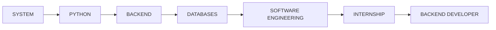

<div align="center">

[](https://git.io/typing-svg)

`IT STUDENT` • `PYTHON` • `BACKEND`

</div>

---

## `> QUEM SOU EU | WHO AM I`

```text
Name       :: Pedro Gaudencio
Field      :: Information Technology
Focus      :: Software Development
Main Lang  :: Python
Education  :: ETEC
```

I'm a high school student at ETEC, studying Mechatronics while completing high school.

My main interest is **software development**, with a focus on Python, backend technologies, databases, and problem-solving.

I'm constantly learning, building, and improving my programming skills through practical projects and challenges.

---

## `> TECNOLOGIAS | TECHNOLOGIES`

### `LINGUAGENS | LANGUAGES`

<p>

</p>

### `BACKEND`

<p>


</p>


### `FERRAMENTAS | TOOLS`

<p>


</p>

---

## `> STATUS ATUAL | CURRENT STATUS`

```text
[████████████████████░░░░░] LEARNING

> Studying Python
> Improving problem-solving
> Learning backend development
> Exploring software engineering
> Building technical foundations
```

---

## `> ROADMAP | ROADMAP`



---

## `> ATIVIDADE NO GITHUB | GITHUB ACTIVITY`

<div align="center">
<br>


<br>


<br>
</div>

---

## `> CONTATO | CONTACT`

<div align="center">

[](mailto:gsilvapedro370@gmail.com)
[](https://www.instagram.com/pegaudencio_/)

</div>

---

<div align="center">

```text
[ SYSTEM ONLINE ]
[ LEARN :: BUILD :: IMPROVE ]
```

</div>


