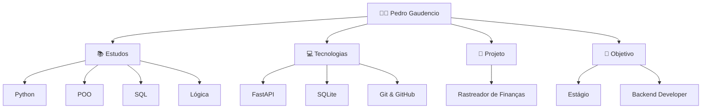

---

**`TI`** **`Student`** **`Python`**

My name is Pedro Gaudencio, I am 15 years old, and I am from São Paulo state, Brazil. I am currently studying Mechatronics at ETEC while completing high school. I am focused on software development and problem-solving through technology, and I am building projects in Python and web development.

---

### 🛠️Linguagens e Ferramentas | Languages and Tools

        

---

### 🗺️ Roadmap de Desenvolvimento | Development Roadmap

---

 
 

 

  

 

  
  

  
  

      <samp>
        <b>Contate-me | Contact me</b>
      </samp>
  

  
 

##

   
   

  
  
  

